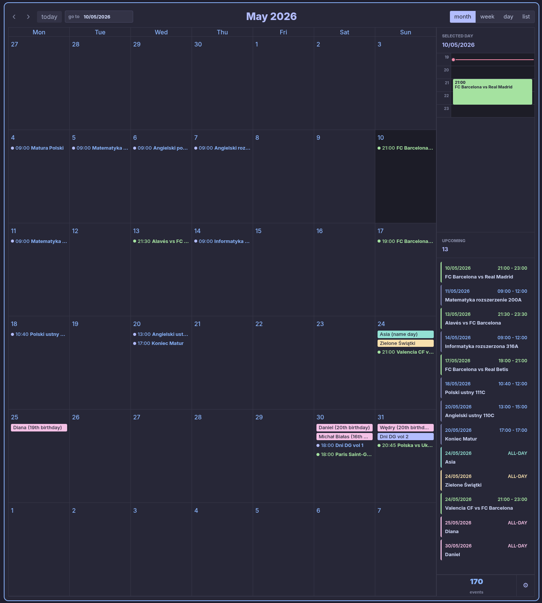

# Obsidian Calendar Editor

Desktop editor for Obsidian Full Calendar notes.

## What this app is
I wrote this to avoid juggling multiple calendar tools and keep all events in one Obsidian vault.  
The app lets you create recurring events directly in `.md` files with YAML frontmatter compatible with [Obsidian Full Calendar](https://github.com/obsidian-community/obsidian-full-calendar).



## What it does
- Add, edit, and delete events
- Switch between month/week/day/list layouts
- Set recurrence (daily, weekly, monthly)
- Import from system calendar sources
- Save each event as markdown in a selected vault folder

## Quick start
1. Create `/obsidian-calendar` release for your platform and run it, or run from source (below).
2. Open settings and set the events folder path in your vault.
3. Open Obsidian and point Full Calendar to the same folder.

## Development
```bash
bun install
bun run start
bun run make
```

## Notes for recruiters
This app is in active maintenance. It uses Electron + React + TypeScript, with practical UX polish added as I use it daily.

## Event file structure
```yaml
title: Meeting
allDay: false
startTime: 14:00
endTime: 15:00
date: 2026-05-15
completed: null
recurringType: weekly
recurringInterval: 1
recurringMaterializeCount: 52
```
